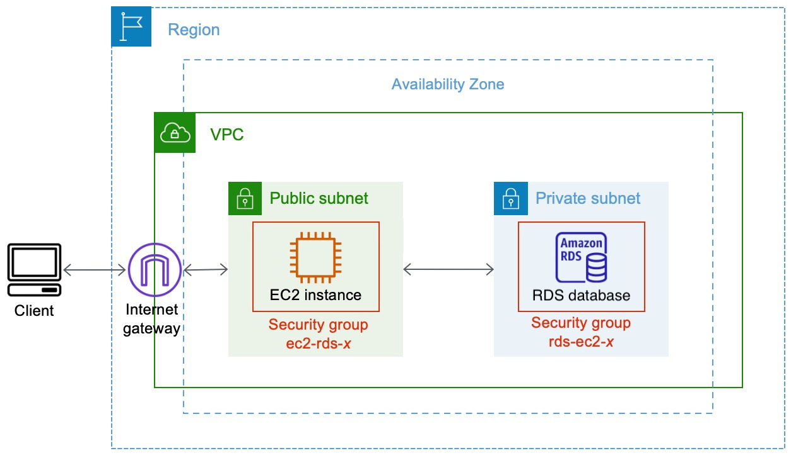

# 🚀 AWS Infrastructure with Terraform

Provision AWS infrastructure using Terraform including VPC, Subnets, EC2, RDS, and more.



---

## 📂 Project Structure


| File | Description|
|------|------------|
| `provider.tf`| AWS provider setup |
| `variables.tf` | Input variable definitions |
| `terraform.tfvars` | Values for variables |
| `vpc.tf` | VPC resource |
| `subnets.tf` | Public and private subnets  |
| `internet-gateway.tf` | Internet Gateway |
| `pub-route-table.tf` | Public Route Table |
| `SGs.tf` | Security Groups (EC2 & RDS) |
| `key.tf` | Key pair setup |
| `EC2.tf` | EC2 instance config |
| `RDS.tf` | RDS instance config |
| `backend.tf` | Remote backend (optional) |
| `ami.tf` | AMI data |

## ✅ Prerequisites

- Terraform ≥ 1.0  
- AWS CLI configured  
- SSH key (for EC2)  
- Graphviz (for visualizing `terraform graph`, optional)

## ⚙️ Usage

```bash
# 1. Clone the repo
git clone https://github.com/tokaashawky/EC2-instance-to-an-Amazon-RDS-database.git
cd EC2-instance-to-an-Amazon-RDS-database
```

```bash
# 2. Initialize Terraform
terraform init
```

```bash
# 3. Set variable values
# Edit terraform.tfvars
region       = "us-east-1"
vpc_cidr     = "10.0.0.0/16"
db_username  = "admin"
db_password  = "your_secure_password"
....
```

```bash
# 4. Review the execution plan
terraform plan
```

```bash
# 5. Apply the infrastructure
terraform apply
```

```bash
# 6. Destroy resources when done
terraform destroy
```

📊 Visualize the Architecture
```bash
terraform graph | dot -Tpng > graph.png
```

Connect to Bastion and make:
```bash
mysql -h my-free-db.curkgm8agif7.us-east-1.rds.amazonaws.com -u toka -p
```

Then enter your password for connecting with your database
